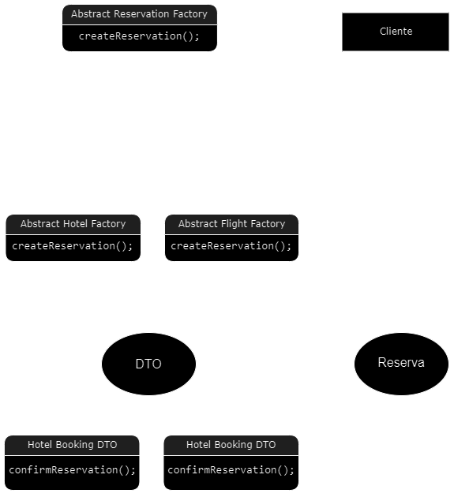

# Prueba Técnica Nº 2 - Java Avanzado

El objetivo de este desafío es aplicar los contenidos dados hasta el momento durante el BOOTCAMP (Git, Java, Spring Boot, Testing, JPA + Hibernate, Spring Security y JWT) en la implementación de una API REST.

## Funcionalidades y Patron de diseño
> Este es un proyecto basado en una agencia de turismo desea llevar a cabo el desarrollo de una aplicación que le permita recibir solicitudes de reservas para los diferentes tipos de paquetes que ofrece.
En este proyecto se permite la reserva y lectura de dos servicios que ofrece la agencia.
Solo el personal autorizado podra acceder a la edicion y eliminación de reservas.
> Se opto por desarrollarlo usando los siguientes patrones de diseño
- `DTO` para transferir datos entre el cliente y el servidor. Crea objetos DTO específicos de hotel y vuelo para las solicitudes y respuestas de cada historia de usuario.
-  Abstract Factory debido a su encapsulación que proporciona un nivel de abstracción y mantiene el código modular y fácil de entender, a su consistencia al poder definir métodos comunes que todas las fábricas deben implementar y por su extensibilidad pensando a largo plazo esto permite agregar más tipos de reservas o funcionalidades comunes a todas las fábricas, la clase abstracta proporciona un lugar central para realizar modificaciones.

## Supuestos
> Condiciones o premisas bajo las cuales se espera que funcione correctamente el software.

- Que al añadir un hotel o vuelo se ponen por defecto los usuarios en el JSON.
- Que para buscar por caracteristicas especiales es necesario ingresar las 3 caracteristicas.
- Que para eliminar un vuelo o hotel este debe estar sin usuarios anexados, pero en caso de hotel puede estar reservado ya que esto lo editan en administración.
- Que al editar se ponen todos los atributos exceptuando el `ID` y se editan los deseados.
- Que los usuarios solo necesitan agregar el nombre para realizar una reserva.
- Que se usaran como prueba el archivo adjunto de Postman.
- Que en el futuro se desea agregar un nuevo tipo de reserva, como "Alquiler de Autos", se podría crear una nueva clase concreta `CarRentalReservationFactory` que extienda `AbstractReservationFactory` y cree instancias de `CarRentalReservation`. Por ello la desición de elección del patrón de diseño, previamente citado.
  

## Archivos importantes
[Archivo SQL](https://github.com/JeinyC/MaldonadoNi-oJeinyCharlotte_pruebatec4/blob/main/Agency/src/main/resources/sql/agency.sql)
[PostMan](https://github.com/JeinyC/MaldonadoNi-oJeinyCharlotte_pruebatec4/blob/main/Agency/docs/postman/REST%20API%20basics-%20CRUD%2C%20test%20%26%20variable.postman_collection.json)

